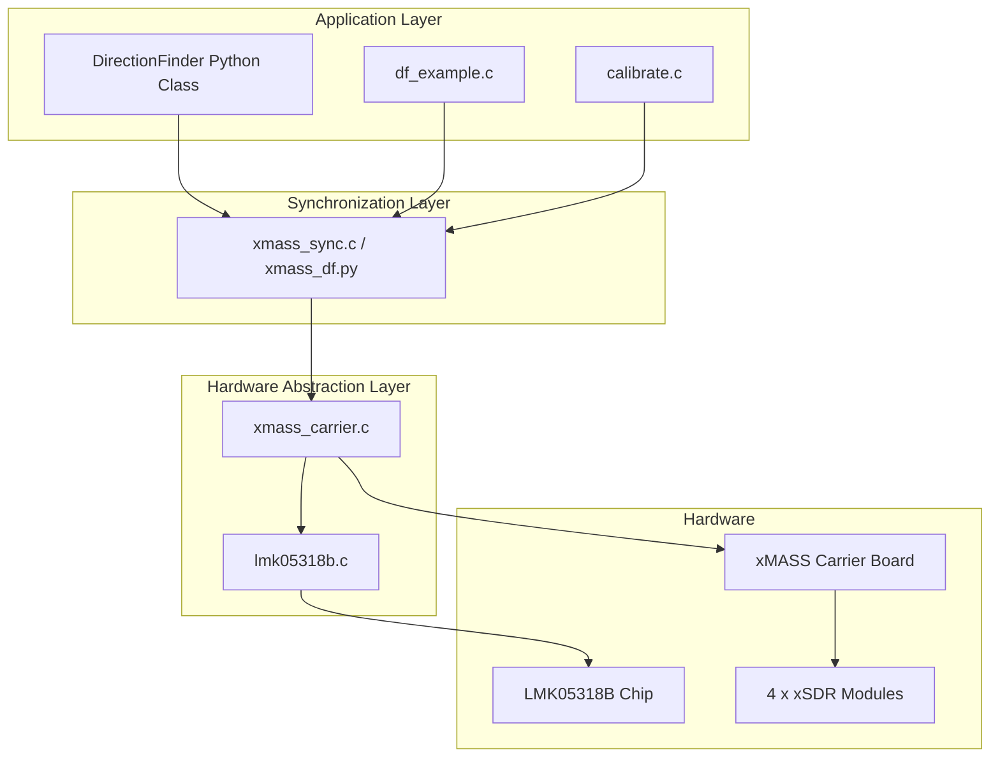

# xMASS Direction Finding Driver Package

**Version:** 1.0.0  
**Author:** Manus AI for Wavelet Lab  
**Date:** 2025-12-26

---

## 1. Overview

This package provides the necessary drivers, libraries, and tools to enable coherent direction finding (DF) capabilities on the Wavelet Lab xMASS platform. The xMASS system, equipped with four xSDR modules and a custom carrier board, is designed for advanced software-defined radio applications. This driver package specifically addresses the critical requirement of synchronizing the four xSDR modules by leveraging the **LMK05318B network synchronizer clock** chip present on the carrier board.

The key innovation, based on recent clarifications, is the use of the LMK05318B to generate and distribute not only a common reference clock but also a **common Local Oscillator (LO) signal** to all four xSDR modules. This architecture ensures a stable and coherent phase relationship across all receiver channels, which is paramount for accurate direction finding.

### Key Features

- **LMK05318B Clock Synthesizer Driver:** A full-featured C driver for configuring the LMK05318B, including register access, PLL configuration, and output channel control.
- **Carrier Board Interface:** A C library (`libxmass_carrier`) that abstracts the hardware details of the xMASS carrier board, providing a clean API for controlling the LMK05318B and managing the xSDR modules.
- **Multi-SDR Synchronization Module:** A C library (`libxmass_sync`) and corresponding Python module (`xmass_df.py`) for managing the 4-channel coherent array. It handles device configuration, data capture, and phase/amplitude calibration.
- **Python Integration:** High-level Python classes (`XMASSSync`, `DirectionFinder`) that provide a simple interface for direction finding, integrating seamlessly with the SoapySDR ecosystem.
- **Direction Finding Algorithms:** Example implementations of both the **Phase Comparison** and **MUSIC** (Multiple Signal Classification) algorithms for Direction of Arrival (DOA) estimation.
- **Calibration Tool:** A command-line utility (`xmass_calibrate`) to perform phase and amplitude calibration of the array, saving the results for later use.
- **Build System:** A comprehensive CMake-based build system for compiling the C libraries, tests, and examples.

### Architecture

The system is architected in a layered approach:

1.  **Hardware Abstraction Layer (HAL):** The `lmk05318b.c` and `xmass_carrier.c` libraries provide low-level control over the hardware.
2.  **Synchronization Layer:** The `xmass_sync.c` library and `xmass_df.py` module manage the coherent operation of the four xSDRs.
3.  **Application Layer:** The `DirectionFinder` class in `xmass_df.py` and the example programs (`df_example.c`, `calibrate.c`) demonstrate how to use the synchronized array for direction finding.



---

## 2. Building the Package

The project uses CMake for building the C libraries and executables.

### Prerequisites

- `cmake`
- `build-essential` (or equivalent C/C++ toolchain)
- `git`
- (Optional) `SoapySDR-dev` for full hardware integration

Install the necessary tools on a Debian-based system:

```bash
sudo apt-get update
sudo apt-get install -y cmake build-essential
```

### Build Steps

1.  **Clone the repository:**

    ```bash
    git clone <repository_url> xmass_df_driver
    cd xmass_df_driver
    ```

2.  **Create a build directory:**

    ```bash
    mkdir build
    cd build
    ```

3.  **Run CMake to configure the project:**

    ```bash
    cmake .. -DCMAKE_BUILD_TYPE=Release
    ```

4.  **Compile the code:**

    ```bash
    make -j$(nproc)
    ```

After a successful build, the libraries (`liblmk05318b.so`, `libxmass_carrier.so`, `libxmass_sync.so`) and executables (`test_lmk05318b`, `test_carrier`, `test_sync`, `xmass_calibrate`, `df_example`) will be located in the `build` directory.

---

## 3. Usage

The package provides both C-level examples and a high-level Python module for interacting with the xMASS array.

### 3.1. Calibration

Before performing direction finding, the array **must** be calibrated to correct for phase and amplitude mismatches between the channels. This is done using the `xmass_calibrate` tool.

1.  **Connect a Signal Source:** Connect a stable CW (Continuous Wave) signal source to a test antenna placed in the far-field of the xMASS array. The signal should be strong and clean.

2.  **Run the Calibration Tool:** Execute the `xmass_calibrate` program, specifying the frequency of your signal source.

    ```bash
    # Calibrate using a 150.5 MHz signal
    ./build/xmass_calibrate -f 150.5
    ```

    This will perform the calibration and save the results to `/tmp/xmass_calibration.cal` by default. This file is required by the direction finding example.

### 3.2. Direction Finding (C Example)

The `df_example` program demonstrates continuous direction finding.

```bash
# Find the direction of a signal at 150.5 MHz
./build/df_example 150.5
```

The program will load the calibration data and begin streaming from the array, displaying the estimated bearing in real-time.

### 3.3. Direction Finding (Python Module)

The `xmass_df.py` module provides a simple and powerful interface for direction finding.

```python
from xmass_df import DirectionFinder

# Initialize the Direction Finder
# Assumes a linear array with half-wavelength spacing
df = DirectionFinder(element_spacing=0.5)

try:
    # Initialize hardware and run calibration
    # This requires a CW signal at 100 MHz
    df.initialize(calibration_freq=100e6)

    # Find the bearing of a signal at a new frequency
    target_freq = 433.92e6
    print(f"Finding bearing of signal at {target_freq/1e6:.2f} MHz...")

    # Use the MUSIC algorithm for high accuracy
    bearing = df.find_bearing(target_freq, method=\'music\')

    print(f"Estimated Bearing: {bearing:.2f} degrees")

finally:
    # Cleanly shut down the devices
    df.close()
```

---

## 4. Package Contents

| Path                            | Description                                                                 |
| ------------------------------- | --------------------------------------------------------------------------- |
| `src/lmk05318b.c`               | C implementation of the LMK05318B driver.                                   |
| `include/lmk05318b.h`           | Header file for the LMK05318B driver.                                       |
| `src/xmass_carrier.c`           | C implementation of the xMASS carrier board interface.                      |
| `include/xmass_carrier.h`       | Header file for the carrier board interface.                                |
| `src/xmass_sync.c`              | C implementation of the multi-SDR synchronization module.                   |
| `include/xmass_sync.h`          | Header file for the synchronization module.                                 |
| `src/xmass_df.py`               | High-level Python module for synchronization and direction finding.         |
| `src/xmass_soapy.py`            | Python wrapper for SoapySDR integration.                                    |
| `tests/`                        | Directory containing unit tests for the C libraries.                        |
| `examples/`                     | Directory containing example programs (`df_example.c`, `calibrate.c`).      |
| `CMakeLists.txt`                | Main CMake build file for the project.                                      |
| `README.md`                     | This documentation file.                                                    |

---

## 5. Future Work

- **Full SoapySDR Integration:** The current C libraries are standalone. They can be integrated more deeply into a custom SoapySDR module for xMASS.
- **Advanced MUSIC Implementation:** The MUSIC algorithm in the C example is simplified. For production use, it should be replaced with a robust version using a proper linear algebra library like LAPACK.
- **Automated LO Calculation:** The LO frequency calculation in `xmass_carrier.c` assumes a fixed VCO frequency. This should be made more dynamic based on the LMK05318B's actual configuration.
- **GUI Application:** A graphical user interface could be developed to visualize the DOA spectrum and manage the array.
